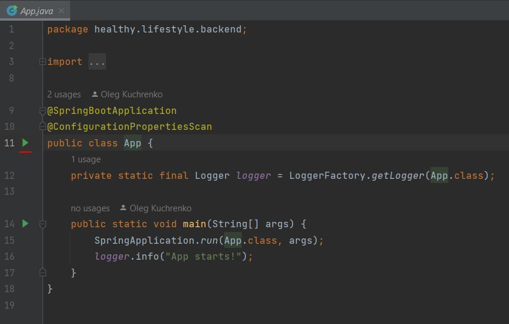
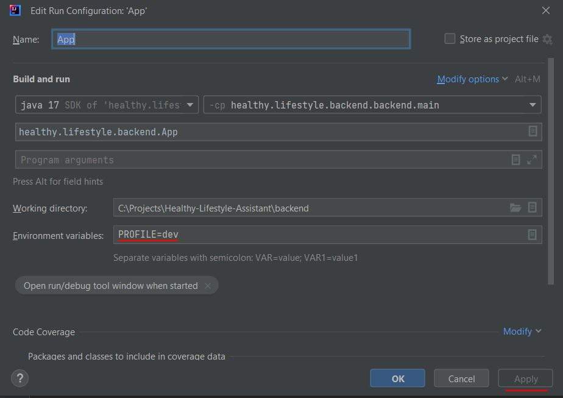
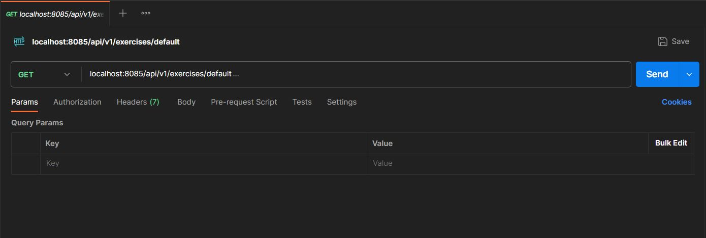

# Onboarding

For questions and support please refer to the “Onboarding” channel in the Slack chat.

[Work with Documentation](#work-with-documentation)  
[Work with Codebase](#work-with-codebase)  
[Understand Kanban Board](#understand-kanban-board)  
[Fit Requirements for Your Local Machine](#fit-requirements-for-your-local-machine)  
[Clone Repositories and Run Code](#clone-repositories-and-run-code)  
[Test Application](#test-application)  

## Work with Documentation

1. Read [Project’s description](https://github.com/Healthy-Lifestyle-Assistant/docs/blob/main/README.md)
1. Read [User stories](https://github.com/Healthy-Lifestyle-Assistant/docs/tree/main/User-Stories)
1. Overview [Domain area diagram](https://github.com/Healthy-Lifestyle-Assistant/docs/blob/main/Diagrams/Domain-Diagram.md)
1. Overview [Database diagram](https://github.com/Healthy-Lifestyle-Assistant/docs/blob/main/Diagrams/Database-Diagram.md)
1. Overview [Deploy diagram](https://github.com/Healthy-Lifestyle-Assistant/docs/blob/main/Diagrams/Deploy-Diagram.md)
1. Read [REST API endpoints](https://github.com/Healthy-Lifestyle-Assistant/docs/tree/main/REST-API)

[Top](#onboarding)

## Work with Codebase

Navigate through repositories on GitHub. Don’t clone them at this stage.

### Backend

1. Go to [Backend repository](https://github.com/Healthy-Lifestyle-Assistant/backend) 
1. Discover dependencies of the project in the `build.gradle` file.
1. Discover project structure in the `src` directory: `main` directory for source code, and `test` directory for tests.
1. Discover a typical structure of the modules like `users` and `workout` in the `main` directory. These modules are dedicated to the business logic related to the users and workouts correspondingly. Such modules contain `model` and `repository` directories to deal with ORM and database, `service` directory for business logic, `dto` (means Data transfer objects) for transforming model data to other forms, `controller` for routing HTTP requests.
1. Discover common modules like `security`, `exception`, `config`, `validation`.
1. Discover `resources` directory and its configuration files.
1. Discover `test` directory. It has a similar structure to `main` directory and contains unit and end-to-end tests.
1. Discover `.github` directory. It contains instructions for GitHub Actions. When pull request is created, then this file starts automatically by GitHub, and performs a build command to ensure that there are no errors. After successful build a pull request can be merged.
1. Discover `Actions` tab where a history of GitHub Actions is stored.
1. Discover `Issues` tab, it contains a list of the tasks to do.

### Frontend

1. Go to [Frontend repository](https://github.com/Healthy-Lifestyle-Assistant/frontend)
1. Discover dependencies of the project in the `package.json` file.
1. Discover project structure in the `src` directory: `views` directory contains full HTML page, `components` should contain components that are building blocks for HTML pages, file `store.js` manages state of the application, file `router/index.js` is responsible for routing between pages.
1. Discover `.github` directory. It contains instructions for GitHub Actions. When pull request is created, then this file starts automatically by GitHub, and performs a build command to ensure that there are no errors. After successful build a pull request can be merged.
1. Discover `Actions` tab where a history of GitHub Actions is stored.
1. Discover `Issues` tab, it contains a list of the tasks to do.

[Top](#onboarding)

## Understand Kanban Board
1. Go to [Kanban Board](https://github.com/orgs/Healthy-Lifestyle-Assistant/projects/1)
1. Discover Board’s structure: Todo, In-progress, On-review, Done.

[Top](#onboarding)

## Fit Requirements for Your Local Machine

1. Install [GitBash](https://git-scm.com/downloads)
1. Install [Docker Desktop](https://docs.docker.com/desktop/install/windows-install/)
1. Install [JDK 17](https://www.oracle.com/java/technologies/javase/jdk17-archive-downloads.html) 
1. Install [Gradle 8](https://docs.gradle.org/current/userguide/installation.html) 
1. Install [Node 18](https://nodejs.org/en/download)
1. Install [PostgreSQL 12](https://www.postgresql.org/download/) and [PgAdmin](https://www.pgadmin.org/download/)
1. Install [Postman](https://www.postman.com/downloads/)
1. Install [Intellij IDEA Community](https://www.jetbrains.com/idea/download)
1. Install [VS Code](https://code.visualstudio.com/download)  
1. Install [Google Chrome](https://www.google.com/chrome/)  
1. Install [Slack Desktop](https://slack.com/downloads/windows)  
1. Install [Figma Desktop](https://www.figma.com/downloads/)  

[Top](#onboarding)

## Clone Repositories and Run Code

1. Create a separate directory on your machine like `C:/HLA/` or `C:/Projects/HLA/`.

### Frontend

1. Navigate to the `HLA` directory, open GitBash from this directory.
1. In GitBash type `git clone https://github.com/Healthy-Lifestyle-Assistant/frontend.git`
1. Ensure that the `frontend` directory appears.
1. In VS Code, select `Open folder` and choose `HLA/frontend`.
1. Ensure your are on the `main` branch (left bottom corner).
1. In a console and type `npm install`.
1. In a console and type `npm run serve`, ensure there are no errors.
1. In Chrome go to `localhost:8080`.
1. Ensure that application works.

### Backend

1. Navigate to the `HLA` directory, open GitBash from this directory.
1. In GitBash type `git clone https://github.com/Healthy-Lifestyle-Assistant/backend.git`
1. Ensure that the `backend` directory appears.
1. In Intellij IDEA select `Open Project` and add `HLA/backend`. If the IDE informs that JDK is not selected, select JDK 17.
1. Navigate to the App class in the `main` directory.
1. Press on a green run button and select `Modify Run Configuration`.

7. In the section “Environment variables” put “PROFILE=dev”, apply changes.

8. Run “App” configuration, ensure there are no errors.

[Top](#onboarding)

## Test Application

### Manual Testing

1. Run both front and back.
1. Navigate through the application.
1. Singup and login with the created user.

### Backend Testing with Postman

1. Run backend.
1. In Postman, test any unprotected URL like “localhost:8085/api/v1/exercises/default”.

[Top](#onboarding)
